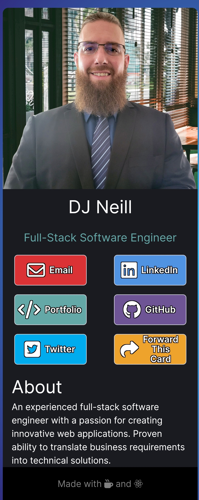

<h1 align="center">Link Tree Card</h1>

Take a look at it here 👉 https://linktreedjneill.netlify.app/

<h2 align="center">Tech Used</h2> 

 React.js, CSS3, Tailwind CSS, Javascript, Next.js

<h2 align="center">Goals and Accomplishments</h2>
An easy way to share my portfolio, LinkedIn, GitHub, and Email all in one place. The forward button will copy the URL to the user's clipboard so they can share it as well.

<h2 align="center">Optimizations</h2>

Optimized this to fit all screen sizes as best as possible. The goal was for the user to have a fluid experience on all their devices. Designed with mobile-first in mind.
